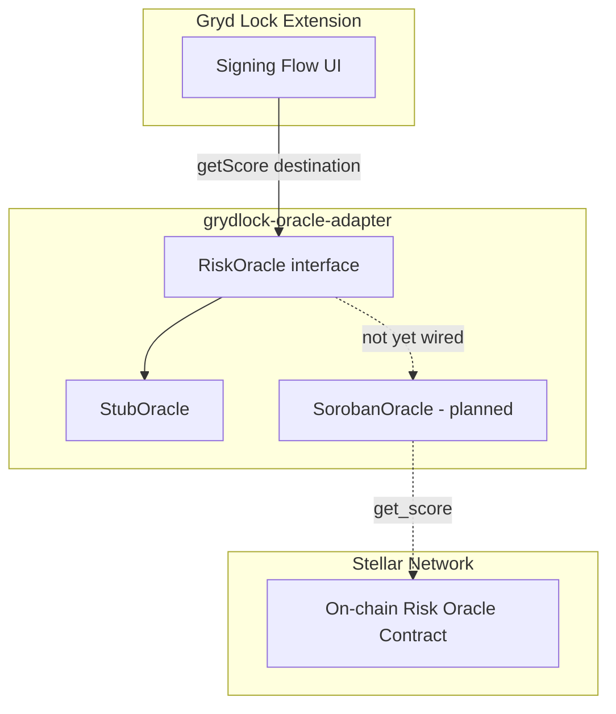
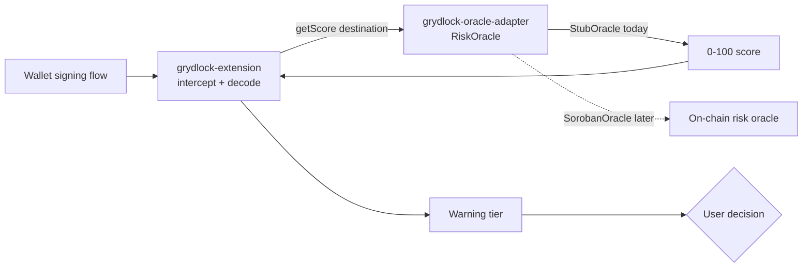

# grydlock-oracle-adapter 🔌

[](https://stellar.org)
[](https://soroban.stellar.org)
[](#license)
[](#roadmap)

Read-client that fetches a 0–100 risk score for a Stellar address or asset from an on-chain risk oracle, and exposes it to the Gryd Lock extension behind a stable interface.

## Overview

`grydlock-oracle-adapter` is the closest thing Gryd Lock has to a backend — but it runs no server. It is a small, read-only client: given a destination, it calls a Soroban smart contract, reads a score, and returns it. Nothing more.

> **Status:** `StubOracle` is implemented and returning scores. A live oracle connection is **not yet wired.**

### The Problem

Gryd Lock needs to warn users about risky Stellar addresses and assets before they sign a transaction, but it should not be in the business of computing that risk itself. Embedding scoring logic directly in the extension would mean:

- The extension would need direct chain access and scoring logic baked into its own codebase
- Swapping or upgrading the scoring engine would require an extension release
- There would be no way to develop or test the extension's warning flow without a live oracle

### What grydlock-oracle-adapter Does

At a high level, it does one thing, deliberately narrowly scoped:

- **🔎 Reads** — takes a destination (Stellar address or asset) and calls the on-chain risk oracle's `get_score()` function via Soroban
- **🔌 Adapts** — normalizes the oracle response behind a single, stable `RiskOracle` interface so the scoring backend can be swapped without touching the extension
- **📤 Exposes** — returns a plain 0–100 score to the Gryd Lock extension, with no chain-specific types leaking across the boundary

## Features

- **`RiskOracle` interface** — one method, `getScore(destination)`, that both implementations satisfy
- **`StubOracle`** — fixed or lookup-table score source for local development and the `grydlock-testkit` evaluation; no network calls
- **`SorobanOracle`** _(planned)_ — calls `get_score()` on the live on-chain risk oracle contract and returns the result
- **Caching and fallback** _(planned)_ — a slow or unreachable oracle degrades gracefully instead of stalling the signing flow

<!-- TODO: expand this list as real implementation features land -->

## Architecture



### Core Components

| Component | Role | Status |
| --- | --- | --- |
| `src/RiskOracle.ts` | Defines the `getScore(destination)` contract | Implemented |
| `src/StubOracle.ts` | Hardcoded lookup-table score source for local dev | Implemented, tested |
| `src/SorobanOracle.ts` | Live client against the on-chain oracle contract | Not started |

## Interface (design)

The adapter exposes one job: turn a destination into a score.

```ts
// illustrative — not yet implemented
interface RiskOracle {
  // Returns a risk score 0–100 for a Stellar address or asset.
  getScore(destination: string): Promise<number>;
}
```

The extension depends on this shape and nothing beneath it. Two implementations are planned:

- **StubOracle** — returns a fixed or lookup-table score. Used for development and for the `grydlock-testkit` evaluation. No network.
- **SorobanOracle** — calls `get_score()` on the live on-chain risk oracle contract and returns the result. Wired in a later phase.

## How the Extension Uses It

```ts
// illustrative
const oracle = new StubOracle();            // swap for SorobanOracle later
const score = await oracle.getScore(dest);  // 0–100
showWarning(score);                         // extension maps score → tier
```

## Repository Structure

```
grydlock-oracle-adapter/
│
├── README.md                         ← This file
├── package.json                      ← Package manifest and npm scripts
├── tsconfig.json                     ← TypeScript compiler config (strict mode)
├── eslint.config.mjs                 ← ESLint flat config
├── .prettierrc.json                  ← Prettier config
├── vitest.config.ts                  ← Vitest config
│
├── .github/workflows/ci.yml          ← CI: typecheck, lint, format check, test, build
│
├── src/
│   ├── RiskOracle.ts                  ← Interface definition
│   ├── StubOracle.ts                  ← Hardcoded lookup-table implementation
│   ├── SorobanOracle.ts               ← Live oracle client (planned, not yet in src/)
│   └── index.ts                       ← Barrel export
│
└── tests/
    └── StubOracle.test.ts             ← getScore range test
```

## Quick Start

```bash
npm install
npm run build      # compile src/ to dist/
npm test           # run the test suite
npm run typecheck  # tsc --noEmit
npm run lint       # eslint .
npm run format     # prettier --write .
```

```ts
import { StubOracle } from './src';

const oracle = new StubOracle();
const score = await oracle.getScore('GAKNOWNWASHTRADERWALLETEXAMPLE'); // 95
```

## Tech Stack

- **TypeScript**
- **Soroban SDK** — reading the on-chain score
- **Stellar SDK (JS)** — address / asset handling
- **Stellar Testnet** — all development

## Testing

```bash
npm test
```

Covers:

- `StubOracle.getScore` returns a number within 0–100 for both known (mapped) and unrecognized destinations

## Roadmap

- [x] Define the `RiskOracle` interface and ship `StubOracle`
- [ ] Wire `StubOracle` into the extension and confirm the query path end to end on testnet
- [ ] Implement `SorobanOracle` against a live oracle contract on testnet
- [ ] Add caching and a timeout / fallback so a slow or unreachable oracle degrades gracefully instead of stalling the signing flow

## Why This Matters for Gryd Lock

- **For the extension** — never talks to the chain directly; it just asks the adapter for a score
- **For the scoring backend** — pluggable; swap the oracle and nothing upstream changes
- **For development** — the signing-flow UI can be built and tested against `StubOracle` with no live backend at all

## Dependencies

- TypeScript ^6.0.3, Vitest ^4.1.10, ESLint ^10.6.0 + typescript-eslint ^8.63.0, Prettier ^3.9.4 — see `package.json` for the full, pinned list
- `soroban-client` / Soroban SDK — _planned, for `SorobanOracle`_
- Stellar SDK (JS) — _planned, for `SorobanOracle`_

## License

<!-- TODO: pick and add a LICENSE file -->

TBD

## Contributing

<!-- TODO: flesh out once the project has real contribution surface area -->

Gryd Lock Oracle Adapter is part of the Gryd Lock project. Contribution guidelines will be added once the initial `StubOracle` implementation lands.

## Gryd Lock Organization

Gryd Lock is split across four repos in the `Gryd-lock` GitHub org:

| Repo | Role | Has code? |
| --- | --- | --- |
| [`grydlock-research`](https://github.com/Gryd-lock/grydlock-research) | Design study: threat model, system design, warning-tier thresholds, evaluation methodology. The reasoning the other three repos implement. | No — design docs only |
| [`grydlock-extension`](https://github.com/Gryd-lock/grydlock-extension) | Browser extension. Intercepts a wallet's signing flow (Freighter first), decodes the pending transaction, asks the oracle adapter for a score, and shows a tiered warning. | Stub |
| **`grydlock-oracle-adapter`** _(this repo)_ | Read-only client. Exposes `RiskOracle.getScore(destination)` to the extension; backed by `StubOracle` today, `SorobanOracle` later. | Yes — `RiskOracle` + `StubOracle` implemented and tested |
| [`grydlock-testkit`](https://github.com/Gryd-lock/grydlock-testkit) | Testnet fixtures and stub scores used to evaluate the extension + adapter together. | Stub |

### How a signing flow moves through them



`grydlock-testkit` supplies the fixture destinations and expected scores that `grydlock-extension`
and `grydlock-oracle-adapter` are evaluated against. `grydlock-research` is upstream of all
three — it defines the threat model and the warning-tier thresholds below.

### Shared contracts (must stay in sync across repos)

**1. `RiskOracle` interface** — defined here at `src/RiskOracle.ts`:

```ts
interface RiskOracle {
  getScore(destination: string): Promise<number>; // 0-100
}
```

`grydlock-extension` depends on this shape only — it does not know whether the score came from
`StubOracle` or a live oracle. If this signature changes, `grydlock-extension` needs a matching
update.

**2. Warning tiers** — defined in `grydlock-research`, consumed by `grydlock-extension` to decide
how loudly to warn:

| Score  | Tier     | Behaviour                       |
| ------ | -------- | -------------------------------- |
| 0–20   | Low      | Proceed                         |
| 21–50  | Elevated | Soft warning                    |
| 51–75  | High     | Strong warning, require confirm |
| 76–100 | Critical | Recommend abort                 |

### Conventions for AI Agents

- Treat this section as the source of truth for **cross-repo** context. Each repo's own README
  covers repo-local conventions.
- Before assuming a name/function/interface still exists in another repo, verify it there — this
  reflects each repo's state as of the last time it was checked, not a live feed.
- If a change here affects `RiskOracle` or the warning-tier thresholds, call it out so the
  corresponding repo can be updated.

## Support

For issues and questions:

- GitHub Issues: https://github.com/Gryd-lock/grydlock-oracle-adapter/issues
- Stellar Discord: https://discord.gg/stellar

---

<div align="center">

**grydlock-oracle-adapter** — the one door Gryd Lock knocks on for a risk score.

_Part of the Gryd Lock project. Interface defined, live oracle not yet wired._

</div>
