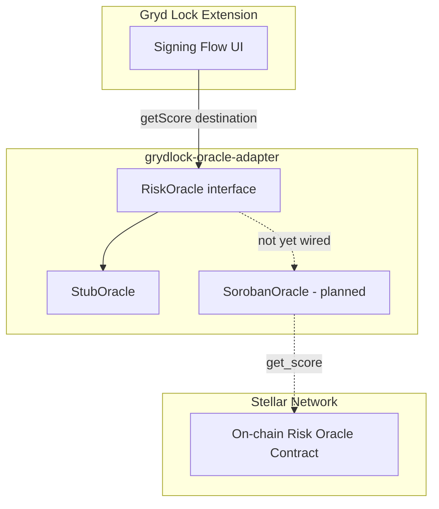
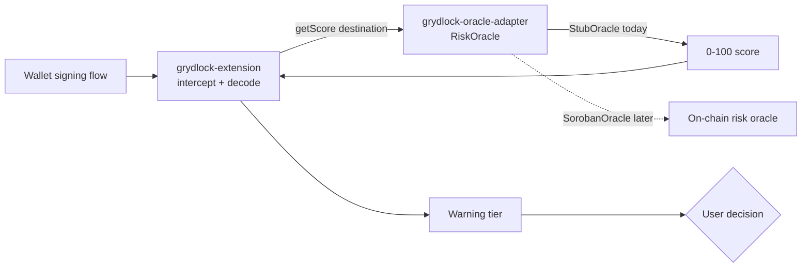

# grydlock-oracle-adapter 🔌

[](https://stellar.org)
[](https://soroban.stellar.org)
[](LICENSE)
[](#roadmap)
[](https://gryd-lock.github.io/grydlock-oracle-adapter/)

Read-client that fetches a 0–100 risk score for a Stellar address or asset from an on-chain risk oracle, and exposes it to the Gryd Lock extension behind a stable interface.

## Overview

`grydlock-oracle-adapter` is the closest thing Gryd Lock has to a backend — but it runs no server. It is a small, read-only client: given a destination, it calls a Soroban smart contract, reads a score, and returns it. Nothing more.

> **Status:** `StubOracle` is implemented and returns scores from the vendored `grydlock-testkit` fixtures. A live oracle connection is **not yet wired.**

### The Problem

Gryd Lock needs to warn users about risky Stellar addresses and assets before they sign a transaction, but it should not be in the business of computing that risk itself. Embedding scoring logic directly in the extension would mean:

- The extension would need direct chain access and scoring logic baked into its own codebase
- Swapping or upgrading the scoring engine would require an extension release
- There would be no way to develop or test the extension's warning flow without a live oracle

### What grydlock-oracle-adapter Does

At a high level, it does one thing, deliberately narrowly scoped:

- **🔎 Reads** — takes a destination (Stellar address or asset) and calls the on-chain risk oracle's `get_score()` function via Soroban
- **🔌 Adapts** — normalizes the oracle response behind a single, stable `RiskOracle` interface so the scoring backend can be swapped without touching the extension
- **📤 Exposes** — returns a plain 0–100 score to the Gryd Lock extension, with no chain-specific types leaking across the boundary

## Documentation

Full API reference is generated from the source JSDoc with [TypeDoc](https://typedoc.org/) and
published to GitHub Pages on every push to `main`:

**📖 [gryd-lock.github.io/grydlock-oracle-adapter](https://gryd-lock.github.io/grydlock-oracle-adapter/)**

To build the reference locally:

```bash
npm run docs        # generate the HTML reference into docs/
npm run docs:check  # validate JSDoc coverage without emitting files (used in CI)
```

`docs:check` fails if any exported symbol is missing a doc comment, so the published reference
stays complete as the public surface grows.

## Features

- **`RiskOracle` interface** — one method, `getScore(destination)`, that both implementations satisfy
- **`StubOracle`** — lookup-table score source backed by vendored `grydlock-testkit` fixtures, for local development and the `grydlock-testkit` evaluation; no network calls
- **`ProvenanceOracle`** — wraps any `RiskOracle` and emits a structured provenance record (source, timestamp, cache status, latency) for every score, via an injectable `Logger`
- **`Logger` interface** — minimal structured logging seam (`debug`/`info`/`warn`/`error`) with a no-op default; the library never writes to the console on its own
- **`SorobanOracle`** _(planned)_ — calls `get_score()` on the live on-chain risk oracle contract and returns the result
- **Fallback** _(planned)_ — a slow or unreachable oracle degrades gracefully instead of stalling the signing flow

<!-- TODO: expand this list as real implementation features land -->

## Architecture



### Core Components

| Component                 | Role                                                                               | Status              |
| ------------------------- | ---------------------------------------------------------------------------------- | ------------------- |
| `src/RiskOracle.ts`       | Defines the `getScore(destination)` contract and the `ScoredResult` metadata types | Implemented         |
| `src/StubOracle.ts`       | Lookup-table score source, backed by vendored `grydlock-testkit` fixtures          | Implemented, tested |
| `src/ProvenanceOracle.ts` | Decorator that logs a structured provenance record for every score                 | Implemented, tested |
| `src/Logger.ts`           | Injectable structured `Logger` interface with a no-op default                      | Implemented         |
| `src/SorobanOracle.ts`    | Live client against the on-chain oracle contract                                   | Not started         |

`src/fixtures/testkit/` is a vendored, point-in-time copy of `grydlock-testkit`'s
`destinations.json` and `scores.json` — not a live sync. If the testkit fixtures change, re-copy
them here to pick up the update.

Because these files are manually copied rather than pulled in as a dependency, a bad copy —
truncated file, wrong schema version, non-numeric score — would otherwise pass TypeScript's
structural typing silently and only surface as a confusing runtime failure. To catch that at the
source, `src/fixtures/testkit/schema.ts` validates the shape of both files, and
`src/fixtures/testkit/index.ts` runs that validation once, when the module is first imported
(not on every `StubOracle.getScore()` call). A malformed fixture throws a `FixtureValidationError`
naming the offending file and field, e.g.:

```
FixtureValidationError: Invalid vendored fixture "scores.json": score for "GABC..." must be a finite number, got string ("10")
```

`StubOracle` and the test suite both import the validated `scores` / `destinations` exports from
`src/fixtures/testkit/index.ts` rather than reading the JSON files directly, so any re-copy of the
testkit fixtures is checked before it can reach either.

## Interface (design)

The adapter exposes one job: turn a destination into a score.

```ts
// illustrative — not yet implemented
interface RiskOracle {
  // Returns a risk score 0–100 for a Stellar address or asset.
  getScore(destination: string): Promise<number>;
}
```

The extension depends on this shape and nothing beneath it. Two implementations are planned:

- **StubOracle** — returns a score from the vendored `grydlock-testkit` fixture lookup table (falling back to a default for unrecognized destinations). Used for development and for the `grydlock-testkit` evaluation. No network.
- **SorobanOracle** — calls `get_score()` on the live on-chain risk oracle contract and returns the result. Wired in a later phase.

### Destination validation

Every `destination` is validated and canonicalized before any score lookup, so a malformed or
forged identifier surfaces as an `InvalidDestinationError` rather than silently scoring as the
default. The grammar is:

| Shape                    | Example                 | Decision                                 |
| ------------------------ | ----------------------- | ---------------------------------------- |
| `G…` ed25519 account     | `GCRRYBV5…`             | Accepted as-is                           |
| `M…` muxed account       | `MCRRYBV5…`             | Accepted, scored as its base `G` account |
| `C…` contract address    | `CADQOBYH…`             | Accepted as-is                           |
| `L…` liquidity pool      | `LAEQSCIJ…`             | Accepted as-is                           |
| `<code>:<issuer>` asset  | `SCAM:GAJLLIIP…`        | Accepted; SEP-11 code + `G` issuer       |
| `S…` `T…` `X…` `P…` `B…` | —                       | Rejected: signer/transaction constructs  |
| anything else            | `not-a-stellar-address` | Rejected                                 |

A muxed address is the same underlying ed25519 account with a routing tag attached, so its
on-chain risk is the base account's risk — rejecting it would leave a user paying a custodial
exchange deposit address with no warning at all. The 64-bit subaccount id is still decoded and
exposed on the validation result for future use.

`src/StrKeyCodec.ts` implements base32, the CRC16-XModem checksum and version-byte/payload-length
checks from the strkey specification rather than delegating to `@stellar/stellar-sdk`. The SDK's
`StrKey` appears in exactly one file — `tests/StrKeyCodec.differential.test.ts` — where it is the
ground-truth oracle for a 5,000+ input differential fuzz suite that asserts identical
accept/reject verdicts and identical decoded payload bytes.

### Score provenance and metadata

Alongside the bare-number contract, the interface file defines an opt-in metadata shape
(issue #17's design) so richer sources — fallback chains, caches — can report how a score
was produced without breaking `getScore` consumers:

```ts
interface ScoredResult {
  score: number; // 0–100
  timestamp: number; // epoch ms when the score was produced
  source: OracleSource; // which oracle/tier answered, e.g. "StubOracle", "soroban"
  cacheStatus: CacheStatus; // "live" | "cache-fresh" | "cache-stale" | "default" | "unknown"
  confidence?: number;
}

interface DetailedRiskOracle extends RiskOracle {
  getScoreDetailed(destination: string): Promise<ScoredResult>;
}
```

`ProvenanceOracle` is a decorator that wraps any `RiskOracle` and emits one structured
provenance record per call through an injected `Logger` — callers keep calling
`getScore(dest)` exactly as before:

```ts
const oracle = new ProvenanceOracle(new StubOracle(), { logger: myLogger });
const score = await oracle.getScore(dest); // same number as before

// myLogger.info('score_provenance', {
//   event: 'score_provenance',
//   destination: 'G...',
//   score: 95,
//   source: 'StubOracle',
//   cacheStatus: 'unknown',
//   timestamp: 1752762896000,
//   latencyMs: 1,
//   outcome: 'success',
// })
```

If the wrapped oracle implements `getScoreDetailed`, its reported source and cache status
flow into the record; otherwise the record uses the wrapper's configured source label and an
`"unknown"` cache status. Failed calls are rethrown unchanged and logged at `error` level
with `outcome: 'error'`.

### Debugging an unexpected score in production

The provenance log is the recommended way to answer "why did the user see this score."
Wire a real `Logger` into `ProvenanceOracle` (routing to the extension's own logging), then
filter for `score_provenance` entries for the destination in question. Each entry tells you:

- **`source`** — which oracle/tier actually answered (live contract, cache, stub, default)
- **`cacheStatus`** — whether the value was live, fresh-from-cache, stale, or a fallback default
- **`timestamp` / `latencyMs`** — when the call completed and how long it took
- **`outcome` / `error`** — whether the underlying source failed and why

A disputed Critical-tier warning that traces to `source: "StubOracle"` or
`cacheStatus: "cache-stale"` is a very different bug than one backed by a live on-chain read —
the provenance record makes that distinction visible after the fact.

## How the Extension Uses It

```ts
// illustrative
const oracle = new StubOracle(); // swap for SorobanOracle later
const score = await oracle.getScore(dest); // 0–100
showWarning(score); // extension maps score → tier
```

## Repository Structure

```
grydlock-oracle-adapter/
│
├── README.md                         ← This file
├── package.json                      ← Package manifest and npm scripts
├── tsconfig.json                     ← TypeScript compiler config (strict mode)
├── eslint.config.mjs                 ← ESLint flat config
├── .prettierrc.json                  ← Prettier config
├── vitest.config.ts                  ← Vitest config
├── commitlint.config.js              ← Conventional-commits lint rules
├── stryker.config.json               ← Mutation testing config (src/ tree)
│
├── .husky/commit-msg                 ← Local commit-msg hook, runs commitlint
├── .github/workflows/ci.yml          ← CI: typecheck, lint, format check, test, build, bundle size, commitlint
│
├── scripts/
│   └── bundle-size.mjs               ← esbuild-based bundle-size budget + tree-shaking check
│
├── src/
│   ├── RiskOracle.ts                  ← Interface definition + ScoredResult metadata types
│   ├── StubOracle.ts                  ← Lookup-table implementation, backed by fixtures/
│   ├── StrKeyCodec.ts                 ← From-scratch Stellar strkey codec (base32 + CRC16-XModem)
│   ├── DestinationValidator.ts        ← Destination grammar: G/M/C/L addresses + SEP-11 assets
│   ├── ProvenanceOracle.ts            ← Decorator emitting a provenance record per score
│   ├── Logger.ts                      ← Injectable structured Logger interface, no-op default
│   ├── SorobanOracle.ts               ← Live oracle client (planned, not yet in src/)
│   ├── fixtures/testkit/
│   │   ├── destinations.json          ← Vendored grydlock-testkit fixture (labelled destinations)
│   │   ├── scores.json                ← Vendored grydlock-testkit fixture (destination -> score)
│   │   ├── schema.ts                  ← Runtime shape validation for both fixture files
│   │   └── index.ts                   ← Validates + exports the fixtures once, at module load
│   └── index.ts                       ← Barrel export
│
└── tests/
    ├── StubOracle.test.ts             ← getScore range + label-ordering tests against the fixtures
    ├── StrKeyCodec.test.ts            ← base32 / CRC16-XModem / version-byte unit tests
    ├── StrKeyCodec.differential.test.ts ← 5k-input differential fuzz against the SDK's StrKey
    ├── DestinationValidator.test.ts   ← destination grammar + SEP-11 asset-code boundary tests
    └── ProvenanceOracle.test.ts       ← provenance record shape, pass-through, and error-path tests
```

## Quick Start

```bash
npm install
npm run build      # compile src/ to dist/
npm test           # run the test suite
npm run typecheck  # tsc --noEmit
npm run lint       # eslint .
npm run format     # prettier --write .
npm run size       # bundle-size budget + tree-shaking check
```

```ts
import { CoalescingOracle, Logger, StubOracle } from './src';

// Optional: structured logger injection (no-op by default).
const logger: Logger = {
  debug: (message, meta) => console.debug(message, meta),
  info: (message, meta) => console.info(message, meta),
  warn: (message, meta) => console.warn(message, meta),
  error: (message, meta) => console.error(message, meta),
};

const oracle = new CoalescingOracle(new StubOracle(logger), logger);

const score = await oracle.getScore('GAJLLIIPHII6OCG4KQJIGPCHVN6DNCRBXHX6DEUTPE7MQ6OONAYBRLET'); // 95, labelled "malicious" in grydlock-testkit
```

## Tech Stack

- **TypeScript**
- **Soroban SDK** — reading the on-chain score
- **Stellar SDK (JS)** — address / asset handling
- **Stellar Testnet** — all development

## Testing

```bash
npm test
```

Covers:

- `StubOracle.getScore` returns a number within 0–100 for every destination in the vendored `grydlock-testkit` fixtures, and a default score for unrecognized destinations
- Fixture destinations labelled `malicious` score higher than those labelled `clean`
- `ProvenanceOracle` passes scores through unchanged, emits one structured provenance record per `getScore`/`getScoreDetailed` call (source, timestamp, cache status, latency), reflects metadata from `DetailedRiskOracle` inners, and logs an `error` outcome when the wrapped oracle throws

## Bundle Size & Tree-Shaking

Because this package ships inside a browser extension (`grydlock-extension`), its footprint
directly affects extension load time and web-store review. CI enforces both a size budget and
tree-shaking behavior on every PR:

```bash
npm run size
```

The check (`scripts/bundle-size.mjs`) bundles the package with esbuild (minified ESM, from the
TypeScript source — the same consumption path the extension's bundler will use once the ESM
build output from #37 lands) for representative import patterns:

| Import pattern                   | Current size (minified) | Budget |
| -------------------------------- | ----------------------- | ------ |
| `import { StubOracle }` only     | ~0.8 KB (~0.6 KB gzip)  | 5 KB   |
| Full barrel (`export * from ..`) | ~0.8 KB (~0.6 KB gzip)  | 10 KB  |

Two things fail CI:

- **Budget regression** — a pattern's minified size exceeds its budget. If the growth is
  intentional (a real feature), raise the budget in `scripts/bundle-size.mjs` in the same PR
  and call it out in the PR description.
- **Tree-shaking leak** — the `StubOracle`-only pattern bundles any module outside its
  explicit allowlist (`StubOracle`, the `RiskOracle` types, and the score fixtures). This
  guarantees that importing only `StubOracle` never drags in `SorobanOracle`, aggregation, or
  other future code; when new modules are added to the barrel, they must be tree-shakeable
  (no module-level side effects) or the check fails.

**For extension-side contributors:** the "StubOracle only" row is the integration cost of the
current recommended usage — under 1 KB gzipped added to the extension bundle.

### Mutation testing

Line/branch coverage only shows whether code executed during a test run, not whether the test
actually asserted on the result. [Stryker Mutator](https://stryker-mutator.io/) is configured
(`stryker.config.json`) to measure that: it makes small deliberate changes ("mutants") to
`src/**/*.ts` — e.g. flipping `??` to `&&`, deleting a return value — and reruns the test suite
against each one. A mutant that still passes the suite ("survived") marks a gap: the code path
ran, but nothing would have caught it breaking.

```bash
npm run test:mutation
```

**Baseline (established alongside this tooling, `src/StubOracle.ts` at the time):** Stryker found
2 mutants in the only file with executable logic (`RiskOracle.ts` is a type-only interface and
`index.ts` is a barrel export — TypeScript erases the former and there's nothing to mutate in the
latter). Of those 2:

- **1 killed** — the `??` → `&&` mutation in `getScore` is caught by the existing "malicious scores
  higher than clean scores" test.
- **1 compile error** — deleting the function body trips `tsc`'s "must return a value" check before
  the mutant ever reaches a test run. This is caught by the `typescript` checker, not a test; it's
  effectively an equivalent mutant given the codebase's `strict` TypeScript config, and isn't
  counted against the mutation score.
- **0 survived.**

Mutation score: **100%** (1/1 of the mutants Stryker could actually run against).

**Threshold policy:** informational-only for now — `thresholds.break` is `null`, so a low score
won't fail CI, and mutation testing runs nightly via
[`.github/workflows/mutation.yml`](.github/workflows/mutation.yml) (also triggerable manually)
rather than gating every PR, since a full mutation run is slower than the rest of the CI pipeline.
Revisit this once `SorobanOracle` and the resilience features land and there's a meaningfully
larger surface — at that point, consider setting `thresholds.break` and/or moving the check into
the main `ci.yml` pipeline.

## Roadmap

- [x] Define the `RiskOracle` interface and ship `StubOracle`
- [x] Back `StubOracle` with vendored `grydlock-testkit` fixtures instead of a hardcoded table
- [ ] Wire `StubOracle` into the extension and confirm the query path end to end on testnet
- [ ] Implement `SorobanOracle` against a live oracle contract on testnet
- [ ] Add caching and a timeout / fallback so a slow or unreachable oracle degrades gracefully instead of stalling the signing flow

## Why This Matters for Gryd Lock

- **For the extension** — never talks to the chain directly; it just asks the adapter for a score
- **For the scoring backend** — pluggable; swap the oracle and nothing upstream changes
- **For development** — the signing-flow UI can be built and tested against `StubOracle` with no live backend at all

## Dependencies

- TypeScript ^6.0.3, Vitest ^4.1.10, ESLint ^10.6.0 + typescript-eslint ^8.63.0, Prettier ^3.9.4 — see `package.json` for the full, pinned list
- `soroban-client` / Soroban SDK — _planned, for `SorobanOracle`_
- Stellar SDK (JS) — _planned, for `SorobanOracle`_

## License

MIT

## Contributing

grydlock-oracle-adapter is being developed as an open-source contribution to the Stellar ecosystem. We are actively looking for collaborators with experience in:

- Stellar / Soroban smart contract development (Rust)
- TypeScript backend and browser-extension development
- On-chain data analysis and Stellar Horizon API integration
- Testing and evaluation methodology (`grydlock-testkit`)

Quick checklist for contributions:

- All tests pass: `npm test`
- Code follows project style guidelines: `npm run lint` and `npm run format:check`
- New features include tests
- Documentation is updated
- Commit messages follow the [Conventional Commits](https://www.conventionalcommits.org/) style below

### Commit message convention

Commit messages are linted with [commitlint](https://commitlint.js.org/) using the
[`@commitlint/config-conventional`](https://github.com/conventional-changelog/commitlint/tree/master/%40commitlint/config-conventional)
preset, so that commit history stays parseable for automated semantic versioning. Every commit
message must follow the [Conventional Commits](https://www.conventionalcommits.org/) format:

```
<type>[optional scope]: <description>

[optional body]

[optional footer(s)]
```

Common `<type>` values:

| Type       | Use for                                                        |
| ---------- | -------------------------------------------------------------- |
| `feat`     | A new feature                                                  |
| `fix`      | A bug fix                                                      |
| `docs`     | Documentation-only changes                                     |
| `style`    | Formatting changes with no code meaning change (e.g. Prettier) |
| `refactor` | A code change that neither fixes a bug nor adds a feature      |
| `test`     | Adding or correcting tests                                     |
| `chore`    | Tooling, dependency, or build-process changes                  |

Examples:

```
feat: add SorobanOracle implementation
fix(RiskOracle): handle missing destination score
docs: update README license section to MIT
chore: add commitlint and husky commit-msg hook
```

This is enforced two ways:

- **Locally** — a husky `commit-msg` hook runs `commitlint` on every commit. Run `npm install`
  once after cloning so husky installs the hook (via the `prepare` script).
- **In CI** — the `commitlint` job in [`.github/workflows/ci.yml`](.github/workflows/ci.yml)
  lints every commit on a pull request, covering contributors who bypass the local hook (e.g.
  `git commit --no-verify`).

## Gryd Lock Organization

Gryd Lock is split across four repos in the `Gryd-lock` GitHub org:

| Repo                                                                    | Role                                                                                                                                                                       | Has code?                                                                                             |
| ----------------------------------------------------------------------- | -------------------------------------------------------------------------------------------------------------------------------------------------------------------------- | ----------------------------------------------------------------------------------------------------- |
| [`grydlock-research`](https://github.com/Gryd-lock/grydlock-research)   | Design study: threat model, system design, warning-tier thresholds, evaluation methodology. The reasoning the other three repos implement.                                 | No — design docs only                                                                                 |
| [`grydlock-extension`](https://github.com/Gryd-lock/grydlock-extension) | Browser extension. Intercepts a wallet's signing flow (Freighter first), decodes the pending transaction, asks the oracle adapter for a score, and shows a tiered warning. | Yes — early build: Freighter intercept, XDR decode, and warning popup implemented                     |
| **`grydlock-oracle-adapter`** _(this repo)_                             | Read-only client. Exposes `RiskOracle.getScore(destination)` to the extension; backed by `StubOracle` today, `SorobanOracle` later.                                        | Yes — `RiskOracle` + `StubOracle` implemented and tested                                              |
| [`grydlock-testkit`](https://github.com/Gryd-lock/grydlock-testkit)     | Testnet fixtures and stub scores used to evaluate the extension + adapter together.                                                                                        | Yes — labelled destinations, stub scores, and sample XDRs implemented, with a fixture validator in CI |

### How a signing flow moves through them



`grydlock-testkit` supplies the fixture destinations and expected scores that `grydlock-extension`
and `grydlock-oracle-adapter` are evaluated against. `grydlock-research` is upstream of all
three — it defines the threat model and the warning-tier thresholds below.

### Shared contracts (must stay in sync across repos)

**1. `RiskOracle` interface** — defined here at `src/RiskOracle.ts`:

```ts
interface RiskOracle {
  getScore(destination: string): Promise<number>; // 0-100
}
```

`grydlock-extension` depends on this shape only — it does not know whether the score came from
`StubOracle` or a live oracle. If this signature changes, `grydlock-extension` needs a matching
update.

**2. Warning tiers** — defined in `grydlock-research`, consumed by `grydlock-extension` to decide
how loudly to warn:

| Score  | Tier     | Behaviour                       |
| ------ | -------- | ------------------------------- |
| 0–20   | Low      | Proceed                         |
| 21–50  | Elevated | Soft warning                    |
| 51–75  | High     | Strong warning, require confirm |
| 76–100 | Critical | Recommend abort                 |

### Verifying cross-repo sync (canonical method)

Don't verify the shared contracts above by reading READMEs across repos — that's exactly the
manual process that lets drift slip through. The canonical way to check sync is:

```bash
npm run sync:check
```

`scripts/check-cross-repo-sync.mjs` fetches the current state of the contracts from the other
public repos and diffs them against this repo:

- **Warning tiers** — parses the canonical table in `grydlock-research`'s README and compares
  it against both `grydlock-extension`'s implementation (`src/lib/tiers.ts`) and this repo's
  own README table
- **`RiskOracle.getScore`** — compares the signature in `src/RiskOracle.ts` against the
  stand-in the extension declares in `src/adapter/oracleAdapter.ts`

On drift it prints a PASS/FAIL report with the expected (canonical) vs actual values, writes
`drift-report.md`, and exits non-zero. CI runs it weekly (Mondays 06:00 UTC, plus on PRs that
touch a contract surface — see `.github/workflows/cross-repo-sync.yml`), since drift
originates in the other repos rather than in pushes here; a scheduled run that finds drift
automatically opens (or updates) a tracking issue labelled `cross-repo-drift`. A fetch or
parse failure exits with a distinct code (2) and is reported as "needs a human look", not as
confirmed drift.

### Conventions for AI Agents

- Treat this section as the source of truth for **cross-repo** context. Each repo's own README
  covers repo-local conventions.
- Before assuming a name/function/interface still exists in another repo, verify it there — this
  reflects each repo's state as of the last time it was checked, not a live feed. For the two
  shared contracts above, run `npm run sync:check` instead of eyeballing.
- If a change here affects `RiskOracle` or the warning-tier thresholds, call it out so the
  corresponding repo can be updated.

## Support

For issues and questions:

- GitHub Issues: https://github.com/Gryd-lock/grydlock-oracle-adapter/issues
- Stellar Discord: https://discord.gg/stellar

---

<div align="center">

**grydlock-oracle-adapter** — the one door Gryd Lock knocks on for a risk score.

_Part of the Gryd Lock project. Interface defined, live oracle not yet wired._

## Oracle Error Types

| Error                        | Code                     | Meaning                                               | Typical Cause                          |
| ---------------------------- | ------------------------ | ----------------------------------------------------- | -------------------------------------- |
| OracleUnavailableError       | ORACLE_UNAVAILABLE       | The oracle could not be reached.                      | Network outage, RPC unavailable        |
| OracleTimeoutError           | ORACLE_TIMEOUT           | The oracle request timed out.                         | Slow network or unresponsive RPC       |
| InvalidDestinationError      | INVALID_DESTINATION      | The supplied Stellar destination is invalid.          | Malformed address or asset identifier  |
| UnrecognizedDestinationError | UNRECOGNIZED_DESTINATION | The destination is valid but not recognized.          | Destination not present in oracle data |
| ContractIncompatibilityError | CONTRACT_INCOMPATIBILITY | The adapter is incompatible with the oracle contract. | ABI/version mismatch                   |

</div>
