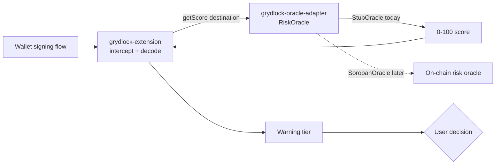

# Gryd Lock — Cross-Repo Map

Gryd Lock is split across four repos in the `Gryd-lock` GitHub org. This file exists so an AI
agent (or a new contributor) working in any one of them can see how the pieces fit together
without cloning all four.

## Repos

| Repo | Role | Has code? |
| --- | --- | --- |
| [`grydlock-research`](https://github.com/Gryd-lock/grydlock-research) | Design study: threat model, system design, warning-tier thresholds, evaluation methodology. The reasoning the other three repos implement. | No — design docs only |
| [`grydlock-extension`](https://github.com/Gryd-lock/grydlock-extension) | Browser extension. Intercepts a wallet's signing flow (Freighter first), decodes the pending transaction, asks the oracle adapter for a score, and shows a tiered warning. | Stub |
| [`grydlock-oracle-adapter`](https://github.com/Gryd-lock/grydlock-oracle-adapter) _(this repo)_ | Read-only client. Exposes `RiskOracle.getScore(destination)` to the extension; backed by `StubOracle` today, `SorobanOracle` later. | Yes — `RiskOracle` + `StubOracle` implemented and tested |
| [`grydlock-testkit`](https://github.com/Gryd-lock/grydlock-testkit) | Testnet fixtures and stub scores used to evaluate the extension + adapter together. | Stub |

## How a signing flow moves through them



`grydlock-testkit` supplies the fixture destinations and expected scores that `grydlock-extension`
and `grydlock-oracle-adapter` are evaluated against. `grydlock-research` is upstream of all three —
it defines the threat model and the warning-tier thresholds below.

## Shared contracts (must stay in sync across repos)

**1. `RiskOracle` interface** — defined here at `src/RiskOracle.ts`:

```ts
interface RiskOracle {
  getScore(destination: string): Promise<number>; // 0-100
}
```

`grydlock-extension` depends on this shape only — it does not know whether the score came from
`StubOracle` or a live oracle. If this signature changes, `grydlock-extension` needs a matching
update.

**2. Warning tiers** — defined in `grydlock-research`, consumed by `grydlock-extension` to decide
how loudly to warn:

| Score  | Tier     | Behaviour                       |
| ------ | -------- | -------------------------------- |
| 0–20   | Low      | Proceed                         |
| 21–50  | Elevated | Soft warning                    |
| 51–75  | High     | Strong warning, require confirm |
| 76–100 | Critical | Recommend abort                 |

## Conventions for AI agents

- Treat this file as the source of truth for **cross-repo** context. Each repo's own README
  covers repo-local conventions.
- Before assuming a name/function/interface still exists in another repo, verify it there — this
  map reflects each repo's state as of the last time it was checked, not a live feed.
- If a change here affects `RiskOracle` or the warning-tier thresholds, call it out so the
  corresponding repo can be updated.
